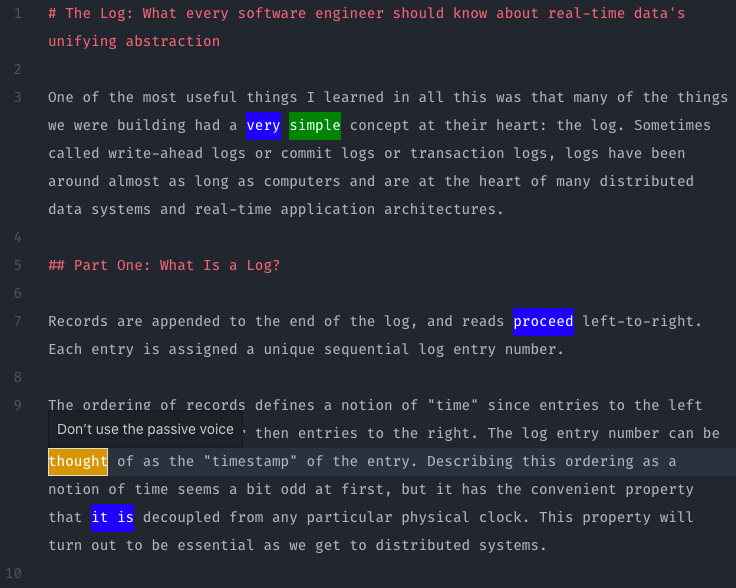

# Proofie

Proofie is an experimental proof-reader for VSCode that helps you write better.



## Install

You can install [proofie from the VSCode Marketplate](https://marketplace.visualstudio.com/items?itemName=MattMueller.proofie).

Once you've installed the extension, open a markdown or text file and paste the following:

```
I was woken by a substantial kick in the butt by Mrs. Abigail.
```

You should see some highlights. Hover over those highlights to see the reason why they're flagged.

Happy writing!

## Supported File Extensions

- .txt
- .md

## Active Plugins

- [retext-readability](https://github.com/retextjs/retext-readability)
- [retext-equality](https://github.com/retextjs/retext-equality)
- [retext-passive](https://github.com/retextjs/retext-passive)
- [retext-simplify](https://github.com/retextjs/retext-simplify)
- [retext-profanities](https://github.com/retextjs/retext-profanities)

# Thanks

Many thanks to Titus (aka @wooorm) for doing the heavy lifting!
